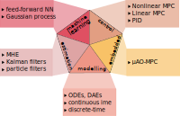

HILO-MPC 
=========

HILO-MPC is a toolbox for **easy, flexible and fast development of machine-learning-supported optimal control and 
estimation problems**. It can be used for model predictive control, moving horizon estimation, Kalman filters and has 
interfaces to embedded MPC software. 

HILO-MPC can leverage [Tensorflow](https://www.tensorflow.org/) and [PyTorch](https://pytorch.org/)
to create machine learning models, and the [CasADi](https://web.casadi.org/) framework to efficiently
build control and estimation problems. The machine learning models can be used (almost) everywhere in the setup
of these problems. 



The following machine learning models are currently supported:

- Artificial feedforward neural networks
- Gaussian processes
 
 The following machine learning models are currently under development
 
- Bayesian neural network
- Recurrent neural network

At the moment the following MPC problems can be solved. 

- Reference tracking nonlinear MPC
- Trajectory tracking nonlinear MPC
- Path following nonlinear MPC
- Economic nonlinear MPC
- Linear MPC

All the nonlinear MPCs support soft constraints, time-variant systems, time-varying parameters and can be used to solve 
minimum-time problems. They work for continuous-time and discrete-time models, in DAE or ODE form. The Linear MPC works 
only with discrete-time models. 

Installation
-------------
You can use pip to install HILO-MPC as follows 

``
pip install hilo-mpc
``

Documentation
-------------
The link to the documentation will appear soon.

Citing HILO-MPC
---------------
If you use HILO-MPC for your research, please cite the following publication:

* J. Pohlodek, B. Morabito, C. Schlauch, P. Zometa, R. Findeisen. **[Flexible development and evaluation of 
machine-learning-supported optimal control and estimation methods via HILO-MPC](https://arxiv.org/abs/2203.13671)**. 
arXiv. 2022.

You can also just copy the following BibTeX entry:

```
@misc{pohlodek2022hilompc,
    title = {Flexible development and evaluation of machine-learning-supported optimal control and estimation methods via {HILO-MPC}},
    author = {Pohlodek, Johannes and Morabito, Bruno and Schlauch, Christian and Zometa, Pablo and Findeisen, Rolf},
    publisher = {arXiv},
    year = {2022},
    doi = {10.48550/ARXIV.2203.13671}
}
```
