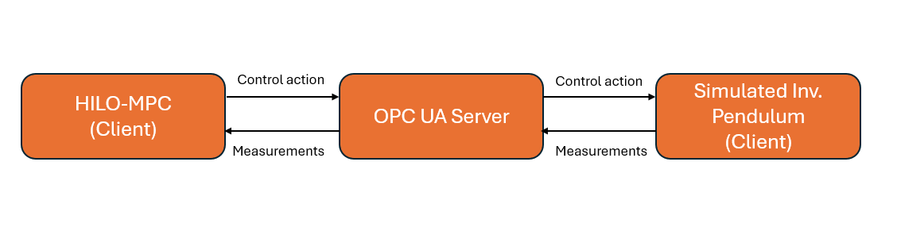

OPC UA Connection - Inverted pendulum example
==============================================

.. contents:: Table of Contents
    :local:
    :depth: 2
    :backlinks: none

Do you want to connect HILO-MPC with actuators and sensors operating in the real world?
HILO-MPC  comes with an integrated interface to OPC UA that let you connect to external
devices effortlessly.

In this example you will learn how to use the HILO-MPC OPC UA interface. We will
test it with a (simulated) inverted pendulum problem, in a software-in-the-loop fashion.
All the files used for this example can be found in our
`example repository <https://github.com/hilo-mpc/examples>`_ in the folder `opcua_pendulum`.

    Inverted pendulum connected via OPC UA: server exposes angle/torque; controller reads/writes.

Pendulum simulation
-------------------
Let us begin by starting the UPC UA server, and then the server that simulates the inverted pendulum.

In the example repository navigate to the folder `opcua_pendulum` and run the following commands in two separate terminal windows:

.. code:: bash

    # Start the OPC UA server
    python3 opcua_pendulum_server.py

Then in another terminal window run:

.. code:: bash

    python3 opcua_pendulum_dashboard.py

The terminal should output something like this:

.. code:: bash

    Dashboard at http://127.0.0.1:8000/ (endpoint opc.tcp://127.0.0.1:4840/freeopcua/pendulum/, ns-idx 2)

If you click on the link, you should see a dashboard on your browser that shows the pendulum. This is reading
the torque from the OPC UA server and updating the pendulum position accordingly. In the next section
we will build a controller that sends the torque commands to the server.

Simple control loop
------------------------
HILO-MPC comes with a built-in control loop that communicates with an OPC UA server. 
This can be already enough for simple control tasks. If you want to have more control, 
you can also build your own control loop using as shown in the next sections.

We want to control an inverted pendulum in the upright position using nonlinear MPC.
First, let us define the MPC controller

.. code:: python

    def build_pendulum_nmpc(Ts_ctrl: float) -> NMPC:
    """NMPC around upright using phi = theta - pi to avoid wrap at ±pi."""
    model = Model()
    x = model.set_dynamical_states(["phi", "omega"])  # reparameterized angle
    u = model.set_inputs(["u"])  # torque

    phi = x[0]
    omega = x[1]
    torque = u[0]

    ode = [
        omega,
        (g / l) * ca.sin(phi) - (c / I) * omega + (1.0 / I) * torque,
    ]
    model.set_equations(ode=ode)
    model.discretize("erk", order=4, inplace=True)
    model.setup(dt=Ts_ctrl)

    mpc = NMPC(model)
    mpc.horizon = 20
    mpc.quad_stage_cost.add_states(names=["phi", "omega"], ref=[0.0, 0.0], weights=[25.0, 2.0])
    mpc.quad_terminal_cost.add_states(names=["phi", "omega"], ref=[0.0, 0.0], weights=[25.0, 10.0])
    u_max = 5.0
    mpc.set_box_constraints(u_lb=[-u_max], u_ub=[u_max])
    mpc.set_initial_guess(x_guess=[0.0, 0.0], u_guess=[0.0])
    mpc.setup(options={"objective_function": "discrete"})
    return mpc

Since the OPC UA server provides the raw angle `theta`, but our NMPC controller works with the 
reparameterized state `phi = theta - pi` (to avoid discontinuities at ±π), we need an adapter that 
bridges this mismatch. The `PendulumNMPCAdapter` wraps our NMPC controller and performs three key tasks:

1. **State transformation**: Converts the raw angle `theta` from the server to `phi = theta - pi`
2. **State augmentation**: Estimates the angular velocity `omega` using finite differences between successive angle measurements
3. **Interface compatibility**: Provides a `SimpleControlLoop`-compatible `optimize(x)` method that the `OPCUASimpleControlLoop` can call

Here is the adapter implementation:

.. code:: python

    class PendulumNMPCAdapter:
        """Adapter presenting a SimpleControlLoop-like optimize(x) for OPCUASimpleControlLoop.
        
        The incoming x is a 1-element vector [theta]. We internally construct
        [phi, omega] and call the wrapped NMPC.optimize().
        """
        
        type = "NMPC"  # so OPCUASimpleControlLoop treats this as MPC for optimize()
        
        def __init__(self, nmpc: NMPC, Ts_ctrl: float) -> None:
            self.nmpc = nmpc
            self.Ts = float(Ts_ctrl)
            self._phi_prev: Optional[float] = None
        
        @staticmethod
        def _wrap_to_pi(a: float) -> float:
            while a <= -math.pi:
                a += 2 * math.pi
            while a > math.pi:
                a -= 2 * math.pi
            return a
        
        def is_setup(self) -> bool:
            return True  # underlying NMPC already set up
        
        def optimize(self, x: Sequence[float], cp=None):  # SimpleControlLoop-compatible
            theta = float(x[0]) if len(x) > 0 else 0.0
            phi = self._wrap_to_pi(theta - math.pi)
            if self._phi_prev is None:
                omega = 0.0
            else:
                dphi = self._wrap_to_pi(phi - self._phi_prev)
                omega = dphi / self.Ts
            self._phi_prev = phi
            return self.nmpc.optimize([phi, omega], cp=cp)

Now we instantiate the adapter with our NMPC controller:

.. code:: python

    nmpc = build_pendulum_nmpc(Ts_ctrl)
    ctrl = PendulumNMPCAdapter(nmpc, Ts_ctrl)

We then need to map the control actions and measurements from the HILO-MPC model to the OPC UA server nodes.

.. code:: python

    # Explicit mapping and loop
    mapping = IOMapping(
        reads={
            "theta": {"node": f"ns={args.ns_idx};s=Pendulum/Angle_rad"},
        },
        writes={
            "u": {"node": f"ns={args.ns_idx};s=Pendulum/Torque_Nm"},
        },
    )

Finally we can start the control loop by running

.. code:: python

    loop = OPCUASimpleControlLoop(
        endpoint=args.endpoint,
        mapping=mapping,
        controller=ctrl,
        estimator=None,
        state_aliases=["theta"],
        control_aliases=["u"],
        parameter_aliases=[],
        period=args.Ts_ctrl,
        reconnect_backoff=tuple(args.reconnect),
        safe_shutdown={"u": 0.0},
    )

    print("OPC UA pendulum (OPCUASimpleControlLoop) started. Ctrl+C to stop.")
    loop.run_sync(max_iters=args.iters)

The full code that uses the OPCUASimpleControlLoop is the file `opcua_simple_control_loop.py` in the example folder.
When you run this script 

.. code:: bash

    python3 opcua_simple_control_loop.py 

you should see the pendulum moving to the upright position as the controller sends torque commands to the OPC UA server.
When you terminate the script, the safe shutdown command will set the torque to zero. You should see the pendulum moving to 
resting position downwards.

Flexible control loop
------------------------
While ``OPCUASimpleControlLoop`` is convenient for basic applications, you may need more control over 
the execution flow for advanced scenarios such as:

- Custom logging and data collection
- Complex state estimation or filtering
- Conditional logic between reading sensors and computing control actions

For these cases, HILO-MPC provides the ``OPCUAConnector`` class, which gives you direct access to 
read and write operations while you manage the control loop yourself.
The full code of the flexible loop can be found in the example repository as `opcua_pendulum_controller.py`. This file
is basically an alternative to `opcua_simple_control_loop.py`, providing more flexibility for advanced use cases.

Setting up the OPC UA connector
~~~~~~~~~~~~~~~~~~~~~~~~~~~~~~~~

First, create an ``OPCUAConnector`` instance with the same I/O mapping as before:

.. code:: python

    from hilo_mpc import OPCUAConnector, IOMapping
    
    mapping = IOMapping(
        reads={
            "theta": {"node": f"ns={args.ns_idx};s=Pendulum/Angle_rad"},
        },
        writes={
            "u": {"node": f"ns={args.ns_idx};s=Pendulum/Torque_Nm"},
        },
    )
    
    connector = OPCUAConnector(
        endpoint=args.endpoint,
        mapping=mapping,
    )
    connector.connect()

The connector provides two key methods: ``read()`` to fetch measurements from the OPC UA server, 
and ``write()`` to send control actions back.

Building a custom control loop
~~~~~~~~~~~~~~~~~~~~~~~~~~~~~~~

With the connector, you can now build your own control loop with full flexibility:

.. code:: python

    import time
    
    # Build controller and adapter as before
    nmpc = build_pendulum_nmpc(Ts_ctrl)
    ctrl = PendulumNMPCAdapter(nmpc, Ts_ctrl)
    
    try:
        while True:
            t_start = time.perf_counter()
            
            # Read current state from OPC UA server
            measurements = connector.read()
            theta = measurements["theta"]
            
            # Compute control action
            solution = ctrl.optimize([theta])
            u_opt = solution.u[0, 0]
            
            # Write control action to OPC UA server
            connector.write({"u": u_opt})
            
            # Optional: Log or process data here
            print(f"θ={theta:.3f} rad, u={u_opt:.3f} Nm")
            
            # Wait for next control cycle
            elapsed = time.perf_counter() - t_start
            time.sleep(max(0, Ts_ctrl - elapsed))
            
    except KeyboardInterrupt:
        print("\nShutting down...")
        connector.write({"u": 0.0})  # Safe shutdown
    finally:
        connector.disconnect()

This custom loop gives you complete control over timing, error handling, and data processing. You can:

- Add customized filters or observers between reading and optimization
- Implement multi-threaded control with separate read/compute/write tasks
- Store data to files or databases during operation
- Handle connection failures with custom retry logic

You can run the flexible control loop script with:

.. code:: bash

    python3 opcua_pendulum_controller.py

(remember to start the server and dashboard first as shown previously). You should see the pendulum moving to the upright position as before.

Comparison: Simple vs. Flexible approach
~~~~~~~~~~~~~~~~~~~~~~~~~~~~~~~~~~~~~~~~~

Choose ``OPCUASimpleControlLoop`` when:

- You have a straightforward sense-compute-actuate cycle
- Standard timing and error handling is sufficient
- You want minimal boilerplate code

Choose ``OPCUAConnector`` with a custom loop when:

- You need fine-grained control over execution order
- You want to add custom processing between control steps
- You need to integrate with other systems or data pipelines
- You require custom error handling or logging strategies

Both approaches use the same underlying OPC UA communication layer, so you can start with the simple 
approach and switch to the flexible one as your requirements grow.

Security and Authentication
----------------------------

In production environments, OPC UA servers typically require authentication and encrypted communication.
HILO-MPC supports both username/password authentication and certificate-based security through optional
parameters available in both ``OPCUASimpleControlLoop`` and ``OPCUAConnector``.

Username and Password Authentication
~~~~~~~~~~~~~~~~~~~~~~~~~~~~~~~~~~~~~

The simplest form of authentication uses username and password credentials:

.. code:: python

    loop = OPCUASimpleControlLoop(
        endpoint="opc.tcp://192.168.1.100:4840/secure/server/",
        mapping=mapping,
        controller=ctrl,
        username="operator",
        password="secure_password",
        period=0.02,
    )

The same parameters work with ``OPCUAConnector``:

.. code:: python

    connector = OPCUAConnector(
        endpoint="opc.tcp://192.168.1.100:4840/secure/server/",
        mapping=mapping,
        username="operator",
        password="secure_password",
    )

Certificate-based Security
~~~~~~~~~~~~~~~~~~~~~~~~~~~

For higher security requirements, OPC UA supports certificate-based encryption and signing. You need to
provide the security mode, security policy, and paths to your certificate and private key files:

.. code:: python

    loop = OPCUASimpleControlLoop(
        endpoint="opc.tcp://192.168.1.100:4840/secure/server/",
        mapping=mapping,
        controller=ctrl,
        security_mode="SignAndEncrypt",
        security_policy="Basic256Sha256",
        cert_path="/path/to/client_cert.der",
        key_path="/path/to/client_key.pem",
        username="operator",
        password="secure_password",
        period=0.02,
    )

Available Security Modes
~~~~~~~~~~~~~~~~~~~~~~~~~

The ``security_mode`` parameter accepts the following values from the OPC UA specification:

- ``"None"``: No security (default, used in examples)
- ``"Sign"``: Messages are signed but not encrypted
- ``"SignAndEncrypt"``: Messages are both signed and encrypted (recommended for production)

Available Security Policies
~~~~~~~~~~~~~~~~~~~~~~~~~~~~

The ``security_policy`` parameter determines the cryptographic algorithms used:

- ``"None"``: No security policy
- ``"Basic128Rsa15"``: RSA 1.5 encryption with 128-bit AES (deprecated, use only for legacy systems)
- ``"Basic256"``: RSA OAEP encryption with 256-bit AES
- ``"Basic256Sha256"``: RSA OAEP with SHA-256 (recommended)
- ``"Aes128_Sha256_RsaOaep"``: Modern algorithm suite with AES-128
- ``"Aes256_Sha256_RsaPss"``: Strongest algorithm suite with AES-256 (recommended for high security)

.. note::
    The security policies available depend on the server configuration. Consult your OPC UA server 
    documentation to determine which policies are supported.
